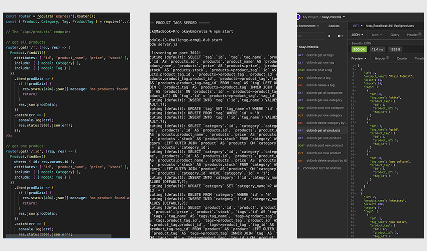

# okayUmbrella 1.0
  

  

  [screencastify walk through](https://watch.screencastify.com/v/Dlg1zxCzCZDz9XNnk2ay)

  ## OVERVIEW:
   The back end api of a product inventory database. his will act as the inventory management system for a front end website. This is the initial structure for a robust system that can track inventory in various ways. Even fairly simple database structures can handle large amounts of information if they are constructed properly.

  ## Table Of Contents:
  [Installation](README.md#installation) 
  [Usage](README.md#usage) 
  [Tests](README.md#tests) 
  [Credits](README.md#credits) 
  [Questions](README.md#questions) 
  [License](README.md#license) 

  ## Installation
  his project uses nodejs, express router, seqelize as an ORM to interact with the mysql database. Once there is a front end, all of the interaction should be opaque and self-sustaining.

  ## Usage
  Without the front end, interaction is most easily handled through Insomnia at the localhost on port 3011.

  ## Tests
  No custom tests, verification was handled through Insomnia.

  ## Credits
  Many thanks to the creators of js, node, express, mysql, insomnia and all of the dependencies without which coding would take a very long time indeed.

  ## Questions
  [Becket, Codeclast](becketbowes@gmail.com)
  [Github Page](http://www.github.com/becketbowes)

  ## License
  [Creative Commons Attribution License, Sun Mar 13 2022 20:52:09 GMT-0400 (Eastern Daylight Time)](https://creativecommons.org/licenses/by/4.0/legalcode)
